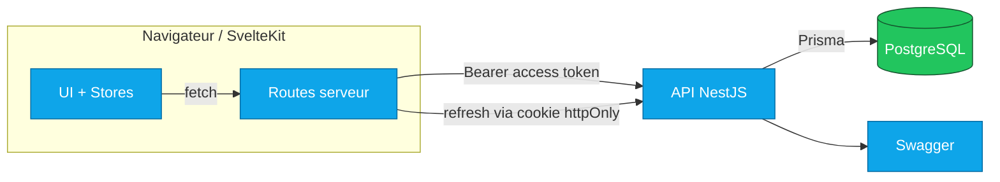
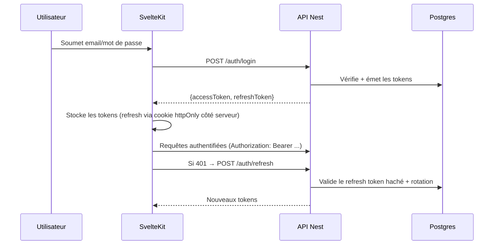
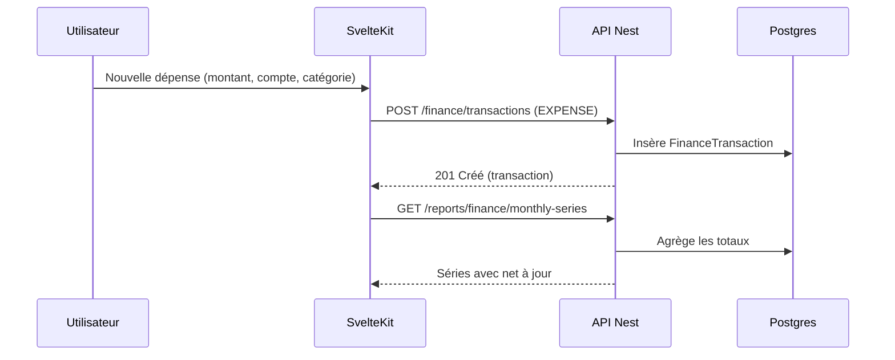
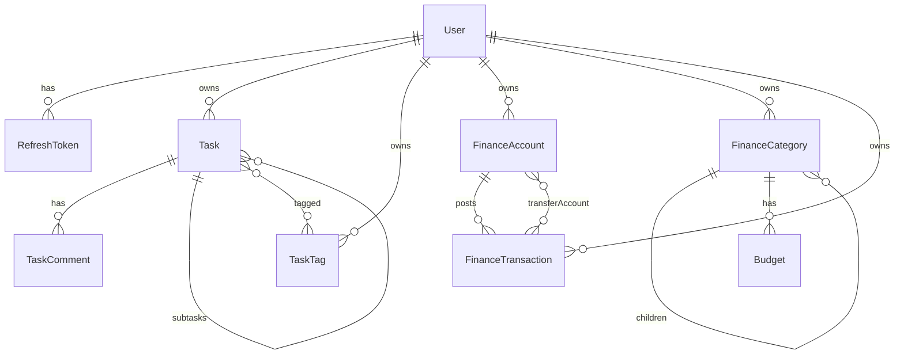

# Cadence 🌿 — Monorepo Tâches + Finance

<p align="center">
  <a href="README.md">🇺🇸 English</a> · <a href="#">🇫🇷 Français</a>
</p>

## Table des matières
- [Fonctionnalités](#-fonctionnalités)
- [Architecture](#-architecture)
- [Flux d’authentification](#-flux-dauthentification-séquence)
- [Flux Finance](#-flux-finance-créer-une-dépense)
- [Modèle de données (ER)](#️-modèle-de-données-er)
- [Prérequis](#️-prérequis)
- [Démarrage rapide](#-démarrage-rapide-tâches-vs-code)
- [Démarrage manuel](#-démarrage-manuel)
- [Configuration](#️-configuration)
- [Surface API](#-surface-api-vue-densemble)
- [Outillage](#-outillage)
- [Sécurité](#-points-clés-sécurité)

Application moderne de productivité personnelle et de gestion financière.

- 📦 `backend/` : NestJS 11 + Prisma + PostgreSQL (JWT + refresh, Swagger, Rapports)
- 🎛️ `frontend/` : SvelteKit 2 + Tailwind + Chart.js (auth SSR-safe, tableaux de bord réactifs)
- 🐘 `docker-compose.yml` : Postgres 17 + pgAdmin (dev uniquement)

---

## ✨ Fonctionnalités
- 🔐 Authentification : connexion, rotation du refresh token, déconnexion
- ✅ Tâches : CRUD, sous-tâches, tags, commentaires, priorités, statuts
- 💸 Finance : Comptes, catégories (arbre), transactions (revenu/dépense/virement), budgets
- 📊 Rapports : Productivité des tâches et Finance (séries mensuelles, dépenses par catégorie, soldes)
- 🛡️ Sécurité : Helmet, limitation de débit, CORS piloté par env, Swagger conditionnel

---

## 🧭 Architecture



---

## 🧪 Flux d’authentification (séquence)



---

## 🧾 Flux Finance (créer une dépense)



---

## 🗄️ Modèle de données (ER)



---

## 🛠️ Prérequis
- Node.js 18+
- npm 9+
- Docker Desktop (pour la base locale)

---

## 🚀 Démarrage rapide (tâches VS Code)
- ▶️ `dev: all` — démarre DB, backend (watch), frontend (watch)
- 🧪 `smoke: finance` — E2E : login → comptes → création de dépense

---

## 🧭 Démarrage manuel

Backend :

```powershell
cd backend
npm install
copy .env.example .env  # éditer DATABASE_URL, secrets JWT, etc.
npm run start:dev
```

Frontend :

```powershell
cd frontend
npm install
npm run dev
```

Base de données (dev uniquement) :

```powershell
docker compose up -d
# arrêter
docker compose down
```

pgAdmin : http://localhost:5050 (admin@orga.local / orga)

---

## ⚙️ Configuration
Voir `backend/.env.example` pour toutes les options (CORS, Swagger, JWT, rate limits).

Conseils prod :
- Définir des secrets forts `JWT_ACCESS_SECRET` et `JWT_REFRESH_SECRET`.
- Restreindre `ALLOWED_ORIGINS` aux domaines de confiance.
- Laisser Swagger désactivé en prod sauf si protégé (`SWAGGER_ENABLED=false`).

---

## 📚 Surface API (vue d’ensemble)
- `POST /auth/login`, `/auth/refresh`, `/auth/logout`, `/auth/register`
- `GET /me`, `PATCH /me`
- `CRUD /users`
- `CRUD /tasks` + tags, commentaires, sous-tâches
- `CRUD /finance/accounts`, `/finance/categories`, `/finance/transactions`, `/finance/budgets`
- `GET /reports/tasks/productivity`
- `GET /reports/finance/{monthly-series,expenses-by-category,balance-by-account}`

Exploration locale via `/docs` (Swagger actif hors production).

---

## 🧰 Outillage
- ESLint + TypeScript strict
- Prisma migrations + seed (Postgres Dockerisé)
- Tableaux de bord Chart.js avec transitions fluides
- Tâches VS Code pour démarrage en un clic

---

## 🔒 Points clés Sécurité
- En-têtes Helmet, limitation de débit globale et sur `/auth`
- CORS piloté par l’environnement (strict en prod)
- Garde prod : refuse de démarrer sans secrets JWT

---

Fait avec ❤️ pour garder votre cadence.