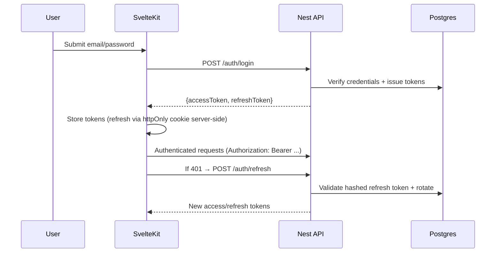
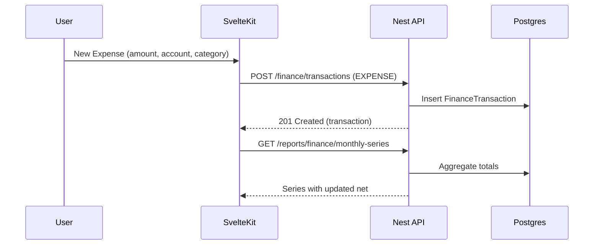
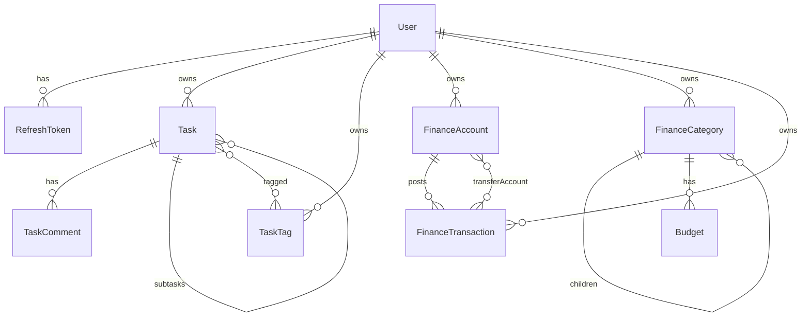

# Cadence 🌿 — Tasks + Finance Monorepo

<p align="center">
	<a href="#">🇺🇸 English</a> · <a href="README.fr.md">🇫🇷 Français</a>
</p>

## Table of Contents
- [Features](#-features)
- [Architecture](#-architecture)
- [Auth Flow](#-auth-flow-sequence)
- [Finance Flow](#-finance-flow-create-expense)
- [Data Model (ER)](#️-data-model-er)
- [Prerequisites](#️-prerequisites)
- [Quick start (VS Code tasks)](#-quick-start-vs-code-tasks)
- [Manual start](#-manual-start)
- [Configuration](#️-configuration)
- [API Surface](#-api-surface-high-level)
- [Tooling](#-tooling)
- [Security Highlights](#-security-highlights)

Modern personal productivity and finance app.

- 📦 `backend/`: NestJS 11 + Prisma + PostgreSQL (JWT auth + refresh, Swagger, Reports)
- 🎛️ `frontend/`: SvelteKit 2 + Tailwind + Chart.js (SSR-safe auth, reactive dashboards)
- 🐘 `docker-compose.yml`: Postgres 17 + pgAdmin (dev-only)

---

## ✨ Features
- 🔐 Authentication: Login, refresh token rotation, logout
- ✅ Tasks: CRUD, subtasks, tags, comments, priorities, statuses
- 💸 Finance: Accounts, categories (tree), transactions (income/expense/transfer), budgets
- 📊 Reports: Tasks productivity and Finance (monthly series, expenses by category, balances)
- 🛡️ Security: Helmet, rate limiting, env-driven CORS, Swagger gating

---

## 🧭 Architecture

```mermaid
flowchart LR
	subgraph Browser [Browser / SvelteKit]
		UI[UI + Stores] -->|fetch| SR[Server routes]
	end

	SR -->|Bearer access token| API[NestJS API]
	SR -->|/api/auth/refresh (httpOnly)| API

	API -- Prisma --> DB[(PostgreSQL)]
	API --> SWG[Swagger]

	classDef svc fill:#0ea5e9,stroke:#0369a1,color:#fff
	classDef db fill:#22c55e,stroke:#14532d,color:#fff
	class API,SR,UI,SWG svc
	class DB db
```

---

## 🧪 Auth Flow (sequence)



---

## 🧾 Finance Flow (create expense)



---

## 🗄️ Data Model (ER)



---

## 🛠️ Prerequisites
- Node.js 18+
- npm 9+
- Docker Desktop (for the local DB)

---

## 🚀 Quick start (VS Code tasks)
- ▶️ `dev: all` — boots DB, backend (watch), frontend (watch)
- 🧪 `smoke: finance` — E2E smoke: login → accounts → create expense

---

## 🧭 Manual start

Backend:

```powershell
cd backend
npm install
copy .env.example .env  # edit DATABASE_URL, JWT secrets, etc.
npm run start:dev
```

Frontend:

```powershell
cd frontend
npm install
npm run dev
```

Database (dev only):

```powershell
docker compose up -d
# stop
docker compose down
```

pgAdmin: http://localhost:5050 (admin@orga.local / orga)

---

## ⚙️ Configuration
See `backend/.env.example` for all options (CORS, Swagger, JWT, rate limits).

Production tips:
- Set strong `JWT_ACCESS_SECRET` and `JWT_REFRESH_SECRET`.
- Restrict `ALLOWED_ORIGINS` to trusted domains.
- Keep Swagger off in prod unless protected (`SWAGGER_ENABLED=false`).

---

## 📚 API Surface (high level)
- `POST /auth/login`, `/auth/refresh`, `/auth/logout`, `/auth/register`
- `GET /me`, `PATCH /me`
- `CRUD /users`
- `CRUD /tasks` + tags, comments, subtasks
- `CRUD /finance/accounts`, `/finance/categories`, `/finance/transactions`, `/finance/budgets`
- `GET /reports/tasks/productivity`
- `GET /reports/finance/{monthly-series,expenses-by-category,balance-by-account}`

Explore locally at `/docs` (Swagger enabled in non-production).

---

## 🧰 Tooling
- ESLint + TypeScript strictness
- Prisma migrations + seed (via Dockerized Postgres)
- Chart.js dashboards with smooth transitions and sensible defaults
- VS Code tasks for one-click dev startup

---

## 🔒 Security Highlights
- Helmet headers, global + `/auth` rate limiting
- Env-driven CORS (tight in prod)
- Production guard: refuses to boot without JWT secrets

---

Made with ❤️ to keep your cadence steady.

